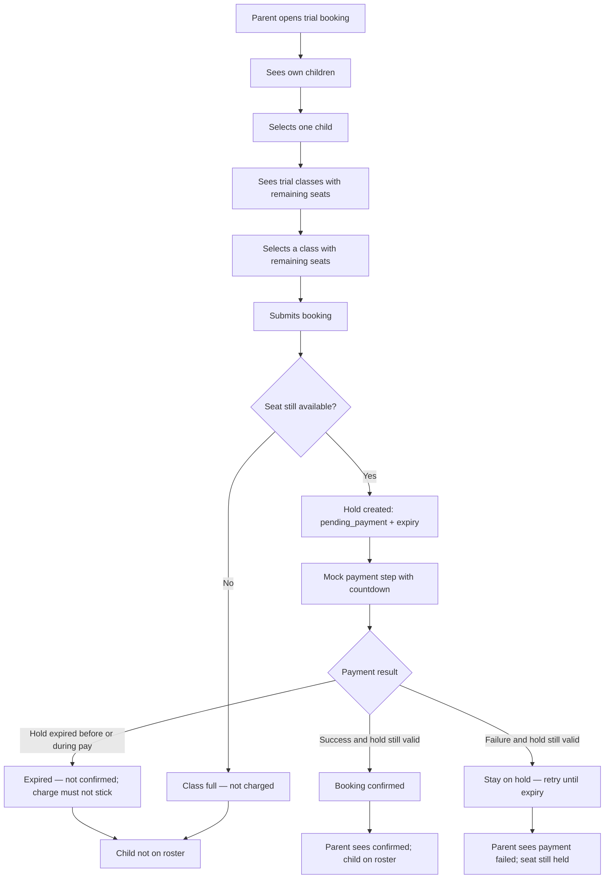
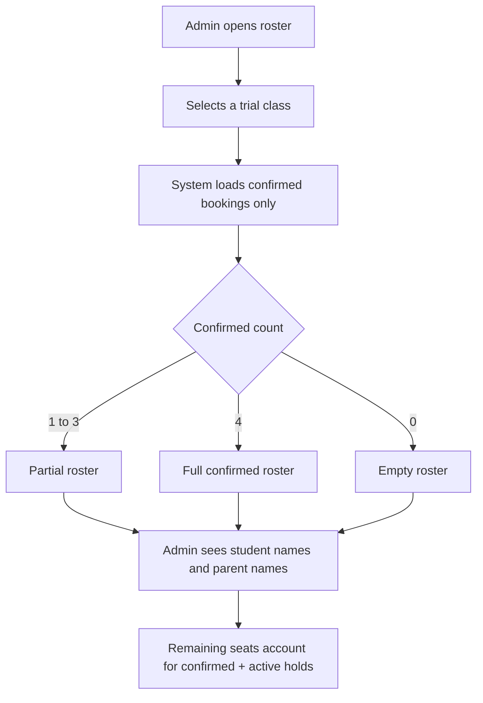
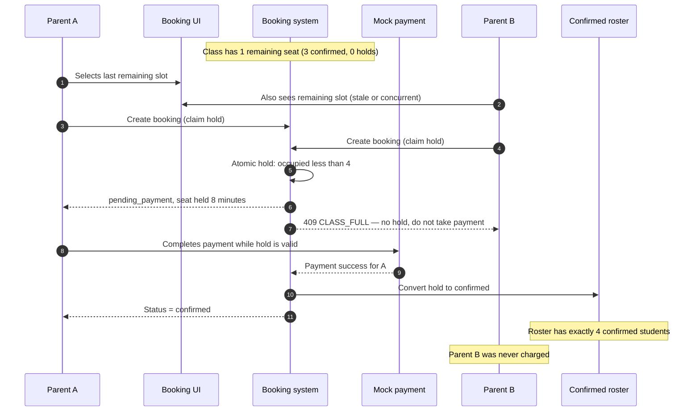
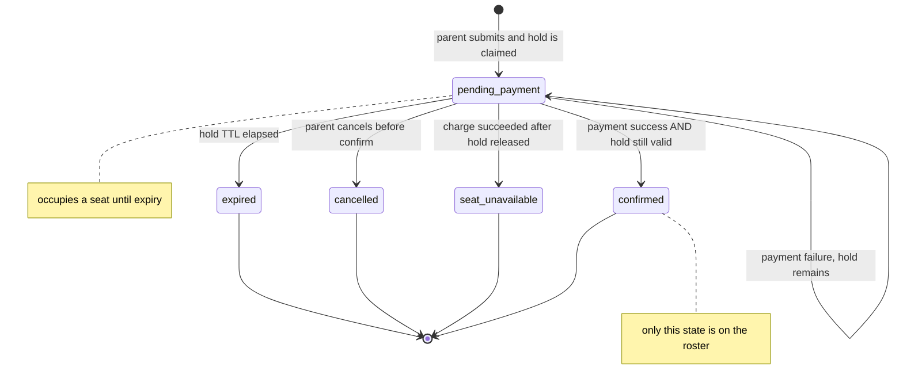

# Product Requirements Document (PRD)

**Product:** Ottodot Trial Class Booking (MVP slice)  
**Project folder:** `online_assesment_edu`  
**Document type:** Product Requirements  
**Status:** Draft — pending review before implementation  
**Audience:** Product reviewer, engineering, QA  
**Related:** [TSD.md](./TSD.md)

---

## 1. Purpose

Ottodot runs live online science and math classes for kids. Parents need to book and pay for a **trial class** for their child. Operations and teachers need an **accurate confirmed roster** before class starts.

This PRD defines the **smallest working product slice** for trial booking only. It specifies who the users are, what they can do, which business rules must never break, and the edge cases the implementation must prove.

Implementation must not start until this PRD and the companion TSD are reviewed and approved.

---

## 2. Problem Statement

Trial seats are scarce (4 students per class). If two parents compete for the last seat, a naive checkout can:

- confirm more than 4 students, or
- charge a parent whose child is not on the roster, or
- confirm the same child twice.

The product must make booking, payment, and roster membership consistent. The last-seat winner is decided **when the seat is held**, not after money has moved. A parent who does not get the seat must **not be charged**.

---

## 3. Goals

1. Let a parent choose one of their children and pick an available trial class.
2. Let a parent submit a trial booking, receive a **timed seat hold**, and go through a mock payment step.
3. Record the payment result against the booking.
4. Show the parent a clear booking status after submission, including hold expiry.
5. Let an admin/teacher see the confirmed trial-class roster.
6. Enforce these invariants at all times:
  - a child cannot have two **confirmed** bookings for the same class
  - a class cannot have more than **4 occupied seats** (`confirmed` + active holds)
  - a class cannot have more than **4 confirmed** students
  - a **failed payment** must not put the child on the confirmed roster
  - when two users compete for the last seat, **at most one** hold is created
  - the parent who loses the last seat is **never charged**

---

## 4. Non-Goals

The following are explicitly **out of scope** for this slice:

| Out of scope                                      | Reason                                                                            |
| ------------------------------------------------- | --------------------------------------------------------------------------------- |
| Regular / paid-term enrollment                    | Requirement is trial booking only                                                 |
| Real payment gateway (Stripe, etc.)               | Mock payment is sufficient; mock must still refuse to charge without a valid hold |
| Parent signup, email/password auth, OTP           | Demo identity is enough                                                           |
| Multi-child checkout in one payment               | One child per booking                                                             |
| Waitlist, auto-promotion, or rebooking automation | Keep the slice small                                                              |
| Teacher live classroom, video, curriculum         | Not a booking concern                                                             |
| Refund execution to a real PSP                    | Record `refund_needed` only for the rare late-charge case                         |
| Notifications (email/SMS/WhatsApp)                | Nice-to-have later                                                                |
| Pricing, promo codes, sibling discounts           | Not required                                                                      |
| Recurring classes / packages                      | Trial only                                                                        |
| Internationalization                              | English is enough                                                                 |
| Polished marketing UI                             | Simple UI is acceptable                                                           |

**Rejected product behavior:** letting two parents both pay, then telling the loser “payment succeeded but the class is full.” That pattern causes complaints and is not this slice.

---

## 5. Personas

### 5.1 Parent (primary)

A parent of one or more school-age children. They want a trial seat in a science or math class, pay quickly, and know whether the seat is confirmed. They should never be surprised by a charge for a class their child is not in.

### 5.2 Child / Student (booked subject, not a system user)

The student does not log in. The parent selects the child. All uniqueness rules are on the **student + class** pair.

### 5.3 Admin / Teacher (secondary)

Needs a trustworthy roster of **confirmed** trial students before class. Pending holds, failed payments, and expired attempts must not appear as confirmed attendees.

---

## 6. Product Principles

1. **Do not charge unless the seat is already held.** Payment converts a hold into a confirmed seat. It does not compete for inventory.
2. **Hold the last seat at submit.** Submitting a booking is a short reservation (default **8 minutes**), the common pattern for tickets, classes, and scarce checkout.
3. **Roster truth over optimistic UX.** The confirmed roster is the source of truth. Remaining-seat counts in the UI are a hint and can be stale; the backend still rejects a hold when the class is full.
4. **Confirmed means paid and seated.** Holds occupy capacity but are not roster members. Failed, expired, and cancelled bookings never appear as confirmed attendees.
5. **Small, testable slice.** Prefer a correct hold + confirm model over visual polish.
6. **Capacity is 4 occupied seats.** Occupied = confirmed students + active holds. Never more than 4.

---

## 7. User Journeys

### 7.1 Parent books a trial (happy path)

### 7.2 Admin / teacher views roster

### 7.3 Required last-seat race (product behavior)

This is a **required scenario**, not an optional stress test. The race is at **hold creation**, not after payment.

**Product rule:** Parent B must not reach a successful charge. The UI must say the class is full, not “You’re in the class,” and not “We charged you but the seat was taken.”

If A abandons payment, the hold expires, the seat returns, and B (or anyone else) may then submit.

---

## 8. Booking Status Model (product language)

Statuses are user-visible after submit. Engineering details are in the TSD.

| Status             | Parent meaning                                         | On confirmed roster? | Occupies a seat?                 |
| ------------------ | ------------------------------------------------------ | -------------------- | -------------------------------- |
| `pending_payment`  | Seat held; complete payment before the timer ends      | No                   | **Yes**, until `hold_expires_at` |
| `confirmed`        | Paid and seated                                        | Yes                  | Yes                              |
| `expired`          | Hold ran out; seat released                            | No                   | No                               |
| `cancelled`        | Booking was cancelled before confirm                   | No                   | No                               |
| `seat_unavailable` | Rare: charge succeeded after the hold was already gone | No                   | No                               |

A failed card does **not** change the booking to a non-holding status. The booking stays `pending_payment` so the parent can retry until the hold expires. Failure is recorded on the payment attempt.

**Why pending occupies a seat:** this is how scarce checkout works in production (classes, events, tickets). The second parent is blocked before payment, which avoids “I paid and my child is not in the class.”

---

## 9. Functional Requirements

### 9.1 Parent: choose child and class

| ID    | Requirement                                                                                               |
| ----- | --------------------------------------------------------------------------------------------------------- |
| FR-01 | Parent can see only children linked to their account.                                                     |
| FR-02 | Parent selects exactly one child per booking.                                                             |
| FR-03 | Parent can see trial classes with remaining seats: `capacity - confirmed - active holds`.                 |
| FR-04 | UI may hide or disable full classes. Backend must still reject new holds on full classes.                 |
| FR-05 | Parent can pick a class that currently shows remaining seats, including a class with exactly 1 seat left. |

### 9.2 Parent: submit booking and pay

| ID    | Requirement                                                                                                                                                                                                                      |
| ----- | -------------------------------------------------------------------------------------------------------------------------------------------------------------------------------------------------------------------------------- |
| FR-06 | Submitting a booking **atomically claims a hold** and creates `pending_payment` for `(student, class)` with `hold_expires_at` (default 8 minutes). If no seat remains, return class full and do not create an occupying booking. |
| FR-07 | Parent is taken to a mock payment step tied to that booking. UI should show the hold countdown.                                                                                                                                  |
| FR-08 | Mock payment can succeed or fail (demo controls or scripted outcomes are acceptable). The mock must not charge if the hold is missing or expired.                                                                                |
| FR-09 | Each payment attempt is recorded, including outcome and timestamp.                                                                                                                                                               |
| FR-10 | After payment processing, parent sees the resulting booking status (and last payment result if still on hold).                                                                                                                   |
| FR-11 | Parent can retry payment on the **same hold** after a failed attempt, until the hold expires.                                                                                                                                    |
| FR-17 | After expiry, the parent cannot confirm that booking. They may submit a new booking only if a seat is free.                                                                                                                      |

### 9.3 Admin / teacher: roster

| ID    | Requirement                                                                          |
| ----- | ------------------------------------------------------------------------------------ |
| FR-12 | Admin can view roster for a trial class.                                             |
| FR-13 | Roster lists only `confirmed` students.                                              |
| FR-14 | Roster shows at least student name, parent name, and booking id / time.              |
| FR-15 | Roster includes confirmed count, active hold count, and remaining seats.             |
| FR-16 | A simple roster API or CLI output is acceptable in addition to, or instead of, a UI. |

### 9.4 Invariants (must hold even under concurrency)

| ID     | Invariant                                                                                                                                                          |
| ------ | ------------------------------------------------------------------------------------------------------------------------------------------------------------------ |
| INV-01 | At most one `confirmed` booking exists per `(student_id, trial_class_id)`.                                                                                         |
| INV-02 | A trial class never has more than 4 `confirmed` bookings.                                                                                                          |
| INV-03 | Failed payment attempts never put a child on the confirmed roster.                                                                                                 |
| INV-04 | `expired`, `cancelled`, and `seat_unavailable` bookings never appear on the confirmed roster.                                                                      |
| INV-05 | `pending_payment` bookings never appear on the confirmed roster.                                                                                                   |
| INV-06 | If two parents submit for the last remaining seat at once, exactly one booking becomes `pending_payment` (hold). The other receives class-full and is not charged. |
| INV-07 | `confirmed + active holds` never exceeds 4.                                                                                                                        |
| INV-08 | A parent is not charged unless they hold a valid, unexpired seat at the moment of charge.                                                                          |

---

## 10. Business Rules

### 10.1 Capacity

- Default capacity is **4 occupied seats per trial class**.
- Occupied = `count(status = confirmed)` + `count(active holds)`.
- An **active hold** is a `pending_payment` booking whose `hold_expires_at` is still in the future (after lazy expiry has run, these are the remaining pending rows).
- Remaining seats = `capacity - occupied`.
- Remaining seats are a **hint** in the UI. The hold-claim transaction is authoritative.

### 10.2 Who can be booked

- A parent may only book children they own.
- One booking request is for one child and one class.
- Two different children of the same parent **may** both attend the same trial class, as long as capacity allows. They are different students.

### 10.3 Duplicate bookings

- The same child cannot have two **confirmed** bookings for the same class.
- The same child cannot have two simultaneous active holds for the same class. A second submit should reuse the existing pending booking (and its remaining hold time) or be rejected with a clear error. Reuse must **not** claim a second seat.
- After `expired` or `cancelled`, the parent may try again if a seat remains.
- After `confirmed`, a new attempt for the same child and class must be rejected as a duplicate.
- After `seat_unavailable`, retry is allowed only if a seat is free and the child is not already confirmed.

### 10.4 Payment failure

- If mock payment fails while the hold is valid, the booking stays `pending_payment`. The seat **stays held** until expiry so the parent can retry.
- The child is **not** added to the confirmed roster.
- Confirmed count does not change. Held count does not change.
- Another parent **cannot** take that seat until the hold expires or is cancelled.
- A new `idempotency_key` is required for a new payment attempt.

### 10.5 Last seat

- Selecting a class in the UI is not a reservation.
- **Submitting the booking is the reservation** (timed hold).
- First successful atomic hold wins the last seat.
- The loser is rejected with class full **before payment**. They are not charged. They do not get `seat_unavailable` after a successful payment.
- Completing payment on a valid hold converts that hold into `confirmed` without taking a second seat.
- If the hold expires before a successful charge, the seat returns to the pool.

### 10.6 Hold duration

- Default hold TTL is **8 minutes** from successful hold claim.
- Demo/tests may use a shorter TTL via config.
- Expiry must release the seat even if no background worker has run yet (lazy expiry on read/write). A periodic sweeper may exist for demo freshness; it is not the only defense.

### 10.7 Class eligibility (minimal)

For this slice, a class is bookable if:

- it exists, and
- it is not marked cancelled (if that field exists), and
- occupied count is less than capacity **at hold-claim time**.

Past-class blocking is recommended but not mandatory for the first demo. If implemented, a class whose start time is in the past cannot receive a new hold or confirm.

---

## 11. Information Architecture (minimal UI)

A polished frontend is not required. If a UI is built, these surfaces are enough:

1. **Parent home:** list of children + list of trial classes with remaining seats.
2. **Confirm booking:** child, class, time, hold countdown, mock pay button (success / fail).
3. **Booking result:** status, message, whether the child is in the class, whether they were charged.
4. **Admin roster:** class selector + table of confirmed students, plus remaining/held counts.

A CLI or HTTP API-only demo is acceptable if the same flows can be executed and verified.

Suggested copy when the last seat was already held:

> That seat was just taken. You were not charged. Try another class, or check back if a hold expires.

Suggested copy when payment fails but the hold remains:

> Payment did not go through. Your seat is still held until {time}. You can try again.

Suggested copy after a successful confirm:

> You’re in the class. {child} is on the roster.

---

## 12. Seed Data Scenarios (required for demo)

The demo dataset must make these cases visible without extra setup:

| Seed case                                           | Purpose                                            |
| --------------------------------------------------- | -------------------------------------------------- |
| Class with available seats (0–2 confirmed, 0 holds) | Happy-path booking                                 |
| Class with exactly 3 confirmed students and 0 holds | One seat left; last-seat hold race                 |
| A child already confirmed on a class                | Duplicate booking attempt                          |
| A scripted payment failure student/class pair       | Payment failure does not join roster; hold remains |
| At least two parents, each with at least one child  | Concurrent last-seat users A and B                 |
| Science and math classes                            | Matches Ottodot context                            |

Suggested narrative seed (names can change in implementation):

- **Parent Maya** → child **Aisha** (used as User A in last-seat race)
- **Parent Ben** → child **Noah** (used as User B in last-seat race)
- **Parent Chen** → child **Li** already confirmed on the 3-seat class
- Class **Math Trial Sat 10:00** has 3 confirmed students (1 seat left, 0 holds)
- Class **Science Trial Sat 11:00** has 1 confirmed student (3 seats left)
- Child **Sam** has a `pending_payment` hold on Science Trial with a recorded `failure` payment attempt (retry demo; not on roster)

---

## 13. Detailed Edge Cases

Each row is a required product behavior. Test mapping lives in the TSD.

### 13.1 Capacity and overbooking

| ID    | Edge case                                         | Expected product behavior                                                |
| ----- | ------------------------------------------------- | ------------------------------------------------------------------------ |
| EC-01 | Parent submits when remaining occupied seats is 0 | Submit rejected as class full; no hold; not charged; child not on roster |
| EC-02 | Class already has 4 confirmed students            | New hold is rejected                                                     |
| EC-03 | 2 remaining seats, 3 parents submit at once       | Exactly 2 holds; 1 class-full; none of the three is charged yet          |
| EC-04 | 1 remaining seat, 2 parents submit at once        | Exactly 1 hold; 1 class-full; loser is not charged                       |
| EC-05 | 1 remaining seat, 5 concurrent submits            | Exactly 1 additional hold; occupied never exceeds 4                      |
| EC-06 | UI still shows 1 seat because of a stale page     | Backend rejects the late hold                                            |

### 13.2 Last-seat race (required scenario)

| ID    | Edge case                                                       | Expected product behavior                                                              |
| ----- | --------------------------------------------------------------- | -------------------------------------------------------------------------------------- |
| EC-07 | A successfully holds the last seat and is on payment; B submits | B is class-full; B has no occupying booking; A still holds                             |
| EC-08 | A then pays successfully while hold is valid                    | A is `confirmed`; roster includes A; confirmed count = 4; held count = 0 for that seat |
| EC-09 | B is not offered a pay step that can succeed                    | B is not charged; B is not on the roster                                               |
| EC-10 | B’s create wins the race instead of A                           | Symmetric: B holds/confirms, A is class-full                                           |
| EC-11 | A and B create-booking requests arrive at the same instant      | Database/transaction layer admits only one hold                                        |
| EC-12 | Gateway returns success after the hold has expired              | Do not confirm; record payment attempt; set `refund_needed`; child not on roster       |
| EC-13 | Parent refreshes after losing the create race                   | Still class-full / no confirmed seat; never flips to confirmed                         |

### 13.3 Duplicate bookings

| ID    | Edge case                                                    | Expected product behavior                                       |
| ----- | ------------------------------------------------------------ | --------------------------------------------------------------- |
| EC-14 | Same child, same class, already `confirmed`                  | New booking/confirm rejected as duplicate                       |
| EC-15 | Double-click submit on an empty booking form                 | At most one pending hold for that pair; occupied increases by 1 |
| EC-16 | Two tabs submit the same child + class at once               | One pending hold; never two holds and never two confirmed       |
| EC-17 | Parent tries to confirm payment twice on same booking        | Second confirm is idempotent: still one confirmed row           |
| EC-18 | Two different children, same class                           | Allowed if seats remain                                         |
| EC-19 | Same child, two different classes                            | Allowed                                                         |
| EC-20 | Same parent, same child, second class while first is pending | Allowed; uniqueness is per class                                |
| EC-21 | Retry after failed payment while hold is valid               | Same pending booking; new payment attempt; no second seat       |
| EC-22 | New submit after hold expired while class is still full      | Rejected because class is full                                  |

### 13.4 Payment failure, expiry, and incomplete payment

| ID    | Edge case                                                             | Expected product behavior                                              |
| ----- | --------------------------------------------------------------------- | ---------------------------------------------------------------------- |
| EC-23 | Mock payment returns failure during a valid hold                      | Booking stays `pending_payment`; not on roster; hold remains           |
| EC-24 | Payment fails on the last remaining seat                              | Other parents still cannot take it until expiry/cancel                 |
| EC-25 | Payment is never completed (user abandons)                            | Booking stays `pending_payment` and **occupies** the seat until expiry |
| EC-26 | Payment provider says success, then a second failure callback arrives | Confirmed booking must not be downgraded because of a late failure     |
| EC-27 | Payment provider retries the same success callback                    | Idempotent; still one confirmed booking and one seat used              |
| EC-28 | Payment succeeds for a booking that was cancelled or expired          | Do not confirm; record `refund_needed` if a charge was captured        |
| EC-40 | Hold expires with no successful payment                               | Status `expired`; `held_count` decreases; seat is bookable again       |
| EC-41 | Parent pays after expiry                                              | Charge must not stick as a confirmed seat; no roster membership        |

### 13.5 Identity and authorization

| ID    | Edge case                                 | Expected product behavior           |
| ----- | ----------------------------------------- | ----------------------------------- |
| EC-29 | Parent tries to book someone else’s child | Rejected                            |
| EC-30 | Unknown parent or missing identity        | Rejected                            |
| EC-31 | Unknown student or class id               | Rejected with not-found             |
| EC-32 | Admin roster requested for unknown class  | Not-found, not an empty fake roster |

### 13.6 Roster correctness

| ID    | Edge case                                                 | Expected product behavior                                |
| ----- | --------------------------------------------------------- | -------------------------------------------------------- |
| EC-33 | Class has mix of pending, expired, unavailable, confirmed | Roster shows confirmed only                              |
| EC-34 | Confirmed count in header disagrees with roster rows      | Must not happen; both derive from confirmed bookings     |
| EC-35 | Student with failed payment appears in ops list           | Allowed in an attempts view; **not** in confirmed roster |
| EC-36 | Empty class                                               | Roster is empty, remaining seats = 4                     |

### 13.7 Data and demo robustness

| ID    | Edge case                                        | Expected product behavior                                                             |
| ----- | ------------------------------------------------ | ------------------------------------------------------------------------------------- |
| EC-37 | Replay seed/setup twice                          | Must not create extra confirmed or hold rows that break capacity                      |
| EC-38 | Booking amount/class metadata missing            | Booking create fails validation before a hold is taken                                |
| EC-39 | Class capacity field is accidentally set above 4 | Product default remains 4 unless a documented override exists; demo classes stay at 4 |

---

## 14. Acceptance Criteria

The slice is accepted when all of the following are true:

1. A parent can select a child, pick a class with remaining seats, submit (receive a hold), mock-pay, and see a status.
2. An admin/teacher can see a confirmed-only roster (UI, API, or CLI).
3. Seed data includes: available class, class with 3 confirmed, duplicate-ready child, payment-failure-on-hold case.
4. Automated tests (or a scripted verification pack) cover:
  - duplicate confirmed booking prevention
  - overbooking prevention (`confirmed + holds <= 4`)
  - payment failure does not confirm and does not release the hold early
  - last-seat race: two concurrent **creates**, only one hold, loser not charged
  - hold expiry releases the seat
5. README (to be written at implementation time) explains approach, why, and tradeoffs — including why holds are used instead of pay-then-maybe-lose.
6. Behavior matches the status model in §8 and invariants INV-01 to INV-08.

---

## 15. Success Metrics (for this assessment)

These are qualitative, not production analytics:

- Zero overbooked classes in tests (`confirmed + holds <= 4`, `confirmed <= 4`).
- Zero duplicate confirmed `(student, class)` pairs in tests.
- Last-seat race test is deterministic and repeatable: one hold, zero charges for the loser.
- A reviewer can run seed + demo in minutes.

---

## 16. Flow Recap: Status Lifecycle

---

## 17. Open Questions For Review

Please confirm or correct these product decisions before implementation:

1. **Timed hold of 8 minutes on submit.** This is the intended last-seat model. Confirm TTL, or prefer 5 / 10 minutes.
2. **Failed payment keeps the hold** until expiry so the parent can retry. Confirm, or prefer immediate release on card failure.
3. **Same parent, two children, same class.** Currently allowed. Confirm.
4. **Same child, two different trial classes.** Currently allowed. Confirm.
5. **Cancel confirmed booking.** Currently out of scope. Confirm we do not need it for the demo. Cancel of an unpaid hold **is** in scope (releases the seat).
6. **Past classes.** Should booking a class that already started be blocked?
7. **UI vs API-only.** Proposed: Vue 3 pages + Go REST (`/api`). Confirm, or prefer HTML/CLI only.

---

## 18. Review Checkpoint

Do **not** implement code until this PRD and [TSD.md](./TSD.md) are reviewed.

Reviewer checklist:

- [x] Scope (trial only) is correct
- [x] Timed-hold last-seat behavior is accepted
- [x] Status list is accepted
- [x] Edge-case list is complete enough
- [x] Open questions in §17 are answered
- [x] TSD tech stack recommendation is accepted