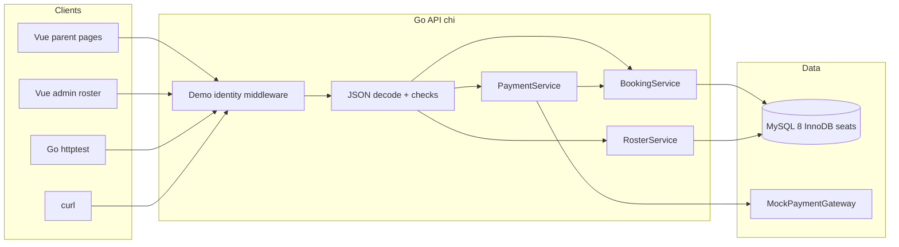
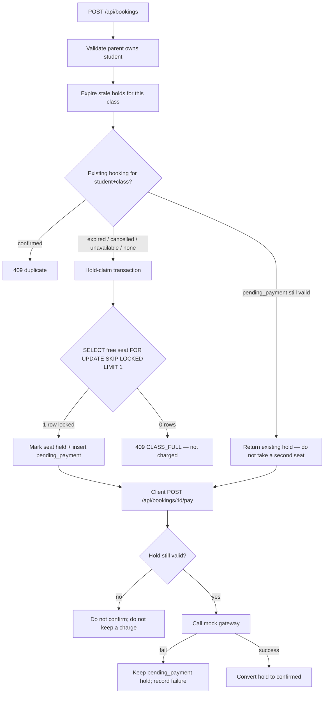
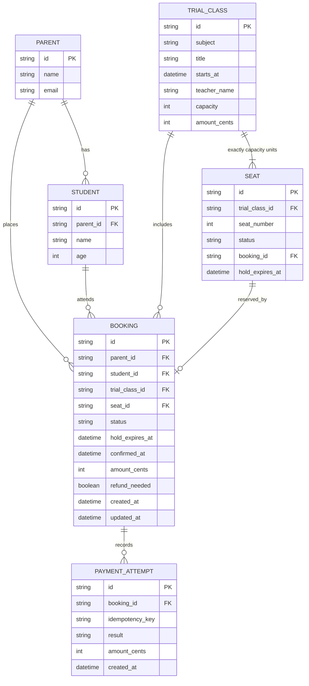
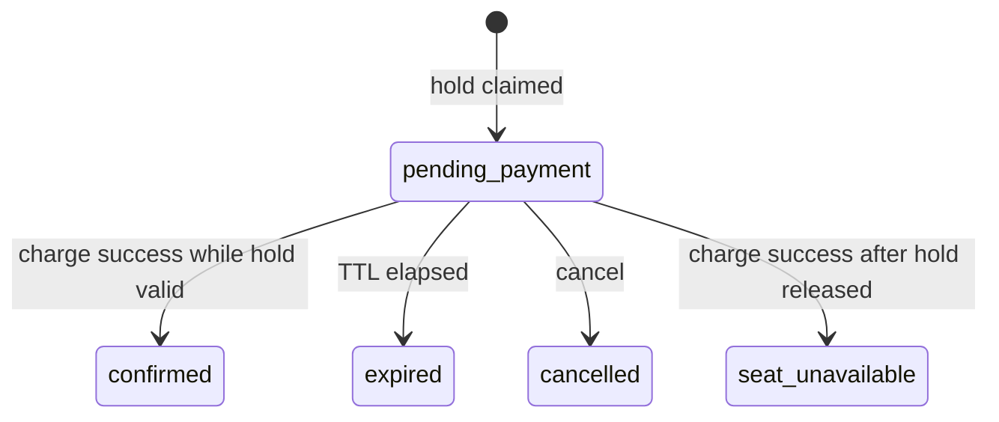
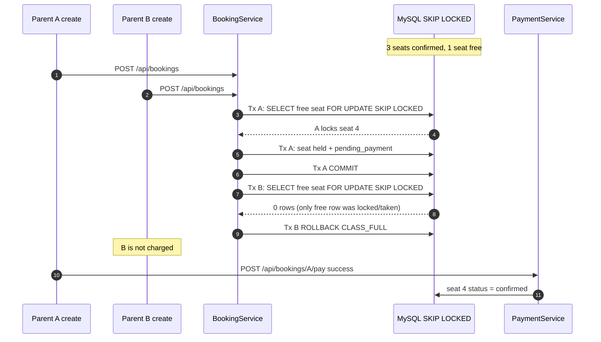
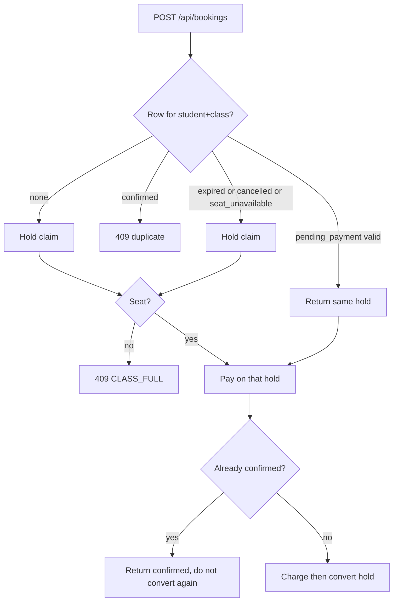

# Technical Specification Document (TSD)

**Product:** Ottodot Trial Class Booking (MVP slice)  
**Project folder:** `online_assesment_edu`  
**Document type:** Technical Specification  
**Status:** Draft — pending review before implementation  
**Related:** [PRD.md](./PRD.md)

This document specifies how the PRD will be implemented. No application code should be written until this TSD is reviewed.

---

## 1. Purpose

Define a small, correct Go backend plus a thin Vue UI for trial booking that:

- models parents, students, trial classes, **one inventory row per seat**, bookings, and payment attempts
- exposes a few explicit REST APIs
- claims a **timed seat hold** at booking create, and converts that hold to confirmed only after a successful charge
- enforces capacity, duplicate, payment-failure, expiry, and last-seat invariants in the database/transaction layer
- uses Vue only as a client of those APIs (no seat logic in the browser)
- is easy to seed, test, and demo locally from one repository

---


## 2. Tech Stack Recommendation


### 2.1 Recommended stack (primary)

One repository. Go owns correctness. Vue is a thin client.


| Layer             | Choice                                                                                 | Version target                   |
| ----------------- | -------------------------------------------------------------------------------------- | -------------------------------- |
| Backend language  | Go                                                                                     | 1.22+                            |
| HTTP API          | `net/http` + chi                                                                       | chi v5                           |
| Validation        | Request structs + explicit checks                                                      | stdlib / small helpers           |
| Database          | MySQL 8 (InnoDB)                                                                       | 8.0.16+ (SKIP LOCKED + CHECK)    |
| MySQL driver      | `github.com/go-sql-driver/mysql`                                                       | latest stable                    |
| Persistence       | `database/sql` + SQL migration files                                                   | no ORM                           |
| Local MySQL       | Docker Compose `mysql:8.0`                                                             | one command to start             |
| Concurrency tests | Go `testing` + `httptest` + `errgroup`                                                 | stdlib                           |
| Mock payment      | In-process `PaymentGateway` interface                                                  | custom                           |
| Frontend          | Vue 3 + Vite                                                                           | Vue 3.5 / Vite 6                 |
| Frontend routing  | Vue Router                                                                             | 4.x                              |
| Frontend HTTP     | `fetch`                                                                                | no extra client library required |
| CSS               | Small custom CSS or Pico CSS                                                           | no component library             |
| Package managers  | Go modules + npm in `frontend/`                                                        | `go.sum` and lockfile committed  |
| Dev UX            | `docker compose up -d`; `go run ./cmd/server` + `npm run dev` in `frontend/`; SQL seed | —                                |


This is the stack to implement unless review requests otherwise.

### 2.2 Why this stack

1. **MySQL 8 InnoDB is the inventory system of record.** Hold and confirm happen in one transaction. No Redis (or second store) for reservations — that split is what causes oversell/undersell.
2. **One row per seat, not one quantity column on the class.** A class of 4 gets 4 `seats` rows. Claiming a hold means locking one `free` row. Occupancy is the count of non-free rows, so a denormalized counter cannot drift.
3. `**SELECT ... FOR UPDATE SKIP LOCKED` is the last-seat claim.** If another transaction already locked a free seat, MySQL skips it and returns a different free row. On the last seat, the loser gets zero rows → `CLASS_FULL`, never a charge. This is the Shopify unit-row pattern, sized to 4 seats (grab 1, not N).
4. **Go matches the author’s backend strength** and makes the concurrent hold-create test natural (`errgroup` / two HTTP clients).
5. **Explicit REST routes stay visible.** Vue never claims a seat.
6. **One repository.** Docker Compose starts MySQL; Vite + Go run beside it.
7. **Mock payment as an interface** lets tests inject `succeed`, `fail`, or `delay`. Charge is only attempted when a hold is valid.


### 2.3 Alternatives considered


| Option                                                                    | Why not primary                                                                                                         |
| ------------------------------------------------------------------------- | ----------------------------------------------------------------------------------------------------------------------- |
| **TypeScript + Express + Prisma**                                         | Previous TSD default. Valid, but weaker fit for a Go/Java-heavy author                                                  |
| **Next.js App Router + Server Actions**                                   | Faster UI, but endpoints are less explicit; concurrent race tests are clumsier                                          |
| **Go + Svelte**                                                           | Also light and capable; Vue is the chosen SPA because it is more commonly paired with API backends                      |
| **Go +** `html/template` **/ HTMX**                                       | Even simpler. Rejected only because this slice will ship a small Vue UI                                                 |
| **React / Next frontend**                                                 | More ceremony than a booking form and roster need                                                                       |
| **Python FastAPI + SQLAlchemy + MySQL + pytest**                          | Equally valid if the reviewer prefers Python. Same seat-row + SKIP LOCKED design applies                                |
| **Spring Boot + JPA**                                                     | Heavier than this MVP; JPA can hide the SKIP LOCKED SQL                                                                 |
| **SQLite + quantity column**                                              | Correct for tiny concurrency, but **no** `SKIP LOCKED` and it is the hot-row model this slice is deliberately not using |
| **One** `trial_classes` **row with** `held_count` **/** `confirmed_count` | Shopify’s failed first MySQL attempt: every buyer locks the same row. Rejected                                          |
| **Redis reservations + MySQL inventory**                                  | No shared transaction; oversell/undersell. Explicitly rejected                                                          |
| **Postgres** `FOR UPDATE SKIP LOCKED`                                     | Same idea, equally valid. MySQL 8 is the chosen dialect so the article’s feature name matches                           |
| **In-memory Map / JSON file**                                             | Too weak for last-seat atomicity. Rejected                                                                              |


### 2.4 Fallback if Vue is dropped

Keep the Go API, MySQL schema, seat rows, SKIP LOCKED claim, and tests. Replace Vue with static HTML served by Go, or curl-only demo. The inventory approach in this TSD stays the same.

---


## 3. Architecture

One Git repository. Two runtimes in development: a Go API process and a Vite/Vue dev server. No message bus. No real PSP.

Expiry: **lazy expiry is required** on every hold/remaining-seats/pay path. An optional in-process ticker may sweep expired holds for demo freshness. The ticker is **not** the only thing that releases seats.

Demo/production mode: build Vue to static files and have the Go server serve `frontend/dist` plus `/api/...` so the reviewer can run one binary.




### 3.1 Process and ports


| Mode | Frontend                     | API                           |
| ---- | ---------------------------- | ----------------------------- |
| Dev  | Vite `http://localhost:5173` | Go `http://localhost:8080`    |
| Demo | Go serves `frontend/dist`    | Same origin, API under `/api` |


- Vue talks to the API with `fetch`. In Vite, proxy `/api` to `localhost:8080` so the browser stays same-origin during dev.
- JSON field names stay camelCase (`studentId`, `remainingSeats`, `holdExpiresAt`) via Go struct tags.
- CORS is only needed if the proxy is not used. Prefer the Vite proxy.
- Vue must not enforce capacity, duplicates, or roster membership. Those live in Go + MySQL seat rows.
- Dev also needs MySQL: `docker compose up -d` (see §15). Connection from env (`MYSQL_DSN`).


### 3.2 Process flow for a booking




---


## 4. Data Model


### 4.1 ERD




### 4.2 Tables and fields

Keep the model small. Every column below exists because a PRD invariant, edge case, or API field needs it.

**parents**


| Column  | Type        | Notes           |
| ------- | ----------- | --------------- |
| `id`    | text PK     | e.g. `par_maya` |
| `name`  | text        |                 |
| `email` | text unique | demo login key  |


**students**


| Column      | Type    | Notes            |
| ----------- | ------- | ---------------- |
| `id`        | text PK | e.g. `stu_aisha` |
| `parent_id` | text FK | required         |
| `name`      | text    |                  |
| `age`       | int     | optional display |


**trial_classes**


| Column         | Type     | Notes                                                    |
| -------------- | -------- | -------------------------------------------------------- |
| `id`           | text PK  | e.g. `cls_math_sat_10`                                   |
| `subject`      | text     | `math`                                                   |
| `title`        | text     |                                                          |
| `starts_at`    | datetime |                                                          |
| `teacher_name` | text     |                                                          |
| `capacity`     | int      | demo CHECK `= 4` (EC-39); **not** the inventory lock row |
| `amount_cents` | int      | trial price; create fails if missing (EC-38)             |


There is **no** `confirmed_count` or `held_count` on the class. Those are Shopify’s hot quantity column. Occupancy is the `seats` table.

No `cancelled` flag on class: PRD §10.7 treats that as optional. Omit for MVP.

**seats** (inventory units — one row per physical seat)

A class with capacity 4 is seeded with **exactly 4 rows**, `seat_number` 1–4, starting `free`. To hold a seat, lock **any one** free row (`SKIP LOCKED`). To hold three in a larger system you would lock three free rows; this product always grabs **one**.


| Column            | Type                | Notes                         |
| ----------------- | ------------------- | ----------------------------- |
| `id`              | text PK             |                               |
| `trial_class_id`  | text NOT NULL FK    |                               |
| `seat_number`     | int NOT NULL        | 1..capacity; unique per class |
| `status`          | text NOT NULL       | `free`                        |
| `booking_id`      | text NULL UNIQUE FK | set while held or confirmed   |
| `hold_expires_at` | datetime NULL       | set while `held`              |


Remaining seats = `COUNT(*) WHERE status = 'free'` after lazy expiry. Held / confirmed counts are the same `COUNT` on those statuses.

**bookings**


| Column            | Type     | Notes                                           |
| ----------------- | -------- | ----------------------------------------------- |
| `id`              | text PK  |                                                 |
| `parent_id`       | text FK  | denormalized for roster joins                   |
| `student_id`      | text FK  |                                                 |
| `trial_class_id`  | text FK  |                                                 |
| `seat_id`         | text FK  | the unit row grabbed with SKIP LOCKED           |
| `status`          | text     | see §5; CHECK list                              |
| `hold_expires_at` | datetime | required while `pending_payment` (EC-25, EC-40) |
| `confirmed_at`    | datetime | required while `confirmed`; roster time (FR-14) |
| `amount_cents`    | int      | snapshot copied from class at hold (EC-38)      |
| `refund_needed`   | boolean  | default false; EC-12, EC-28, EC-41              |
| `created_at`      | datetime | hold created                                    |
| `updated_at`      | datetime |                                                 |


Last payment result is **not** denormalized. FR-10 / EC-21 / EC-23 / EC-35 read the latest `payment_attempts` row for the booking. A class-full loser (EC-04, EC-07, EC-09) has **no booking row** and **no payment_attempt**.

**payment_attempts**


| Column               | Type        | Notes                        |
| -------------------- | ----------- | ---------------------------- |
| `id`                 | text PK     |                              |
| `booking_id`         | text FK     |                              |
| `idempotency_key`    | text unique | client or server generated   |
| `result`             | text        | `success`                    |
| `amount_cents`       | int         | fixed trial price, e.g. 1000 |
| `provider_reference` | text        | mock id                      |
| `created_at`         | datetime    |                              |


### 4.3 Database constraints (non-negotiable)

These constraints are the last line of defense. Application checks are not enough.

```sql
-- ENGINE=InnoDB, MySQL 8.0.16+ (CHECK + SKIP LOCKED)

-- trial_classes
CHECK (capacity = 4)
CHECK (amount_cents > 0)

-- seats: exactly one physical unit per (class, seat_number)
FOREIGN KEY (trial_class_id) REFERENCES trial_classes(id)
UNIQUE (trial_class_id, seat_number)
CHECK (seat_number BETWEEN 1 AND 4)
CHECK (status IN ('free', 'held', 'confirmed'))
CHECK (status != 'held' OR (booking_id IS NOT NULL AND hold_expires_at IS NOT NULL))
CHECK (status != 'confirmed' OR booking_id IS NOT NULL)
UNIQUE (booking_id)  -- NULL unique: many free seats
INDEX seats_class_free (trial_class_id, status)  -- SKIP LOCKED lookup

-- bookings
FOREIGN KEY (parent_id) REFERENCES parents(id)
FOREIGN KEY (student_id) REFERENCES students(id)
FOREIGN KEY (trial_class_id) REFERENCES trial_classes(id)
FOREIGN KEY (seat_id) REFERENCES seats(id)
CHECK (status IN (
  'pending_payment', 'confirmed', 'expired', 'cancelled', 'seat_unavailable'
))
CHECK (status != 'pending_payment' OR hold_expires_at IS NOT NULL)
CHECK (status != 'confirmed' OR confirmed_at IS NOT NULL)
CHECK (amount_cents > 0)

-- MySQL has no SQLite-style partial unique index. Use a generated column:
-- active_pair is NULL for expired/cancelled/seat_unavailable (multiple NULLs allowed).
active_pair VARCHAR(128) GENERATED ALWAYS AS (
  CASE WHEN status IN ('confirmed', 'pending_payment')
       THEN CONCAT(student_id, ':', trial_class_id)
       ELSE NULL END
) STORED,
UNIQUE KEY bookings_one_active (active_pair)

-- payment_attempts
FOREIGN KEY (booking_id) REFERENCES bookings(id)
CHECK (result IN ('success', 'failure', 'pending'))
UNIQUE (idempotency_key)
```

`expired`, `cancelled`, and `seat_unavailable` are **not** unique, so retries are possible after a terminal unsuccessful state (EC-22, EC-40, then a new hold).

Service-level check (cannot be a FK): `booking.parent_id` must equal the student’s `parent_id` (EC-29).

Seed must insert **4 seat rows** per class. Tests assert `COUNT(seats) = capacity`.

Hold-claim, seat update, and booking insert must run in **one InnoDB transaction**. If the active unique key rejects the insert, `ROLLBACK` so the locked seat is released (EC-15, EC-16).

Do not wrap the mock payment HTTP/network call inside that transaction.

### 4.4 Why one row per seat + SKIP LOCKED (not a quantity column)

Shopify’s lesson: a single `quantity` / `held_count` cell is a **hot row**. Every checkout locks it. The fix is **one row per unit** and MySQL 8 `SKIP LOCKED`.

Hold claim (grab any 1 free unit):

```sql
SET TRANSACTION ISOLATION LEVEL READ COMMITTED;
START TRANSACTION;

-- 1. Release expired holds for this class (locks those held rows only)
UPDATE seats
SET status = 'free', booking_id = NULL, hold_expires_at = NULL
WHERE trial_class_id = ?
  AND status = 'held'
  AND hold_expires_at <= CURRENT_TIMESTAMP(3);

UPDATE bookings
SET status = 'expired'
WHERE trial_class_id = ?
  AND status = 'pending_payment'
  AND hold_expires_at <= CURRENT_TIMESTAMP(3);

-- 2. Grab one unit. Locked free rows are skipped, not waited on.
SELECT id
FROM seats
WHERE trial_class_id = ?
  AND status = 'free'
LIMIT 1
FOR UPDATE SKIP LOCKED;

-- 3. If no id: ROLLBACK and return CLASS_FULL (loser is not charged).
-- 4. INSERT booking pending_payment (seat_id, hold_expires_at, amount_cents)
-- 5. UPDATE that seat: status='held', booking_id=?, hold_expires_at=?
COMMIT;
```

- 1 row returned → hold claimed
- 0 rows returned → class full (the last free unit is locked by someone else, or none exist)

Confirm converts **that same unit** without grabbing a second row:

```sql
UPDATE seats
SET status = 'confirmed', hold_expires_at = NULL
WHERE id = ? AND status = 'held' AND booking_id = ?;
```

Release on expiry or cancel: set the seat back to `free` and clear `booking_id`.

Test invariants (source of truth = seat rows):

- `COUNT(*) FROM seats WHERE trial_class_id = ?` = 4
- confirmed bookings = `COUNT(*) FROM seats WHERE status = 'confirmed'`
- active holds = `COUNT(*) FROM seats WHERE status = 'held'`
- remaining = `COUNT(*) FROM seats WHERE status = 'free'` (after lazy expiry)


### 4.5 PRD edge-case coverage (data model)


| PRD items           | How the model supports them                                                       |
| ------------------- | --------------------------------------------------------------------------------- |
| EC-01–EC-06, INV-07 | At most 4 seat rows; SKIP LOCKED returns 0 when none are free                     |
| EC-07–EC-11, INV-06 | Two creates: two `SELECT ... SKIP LOCKED`; last unit goes to one tx               |
| EC-09, INV-08       | no `payment_attempts` unless a seat row is `held` at charge time                  |
| EC-12, EC-28, EC-41 | `refund_needed` + attempt success + booking not `confirmed`; seat not `confirmed` |
| EC-14–EC-16         | generated `active_pair` unique + rollback of the seat lock                        |
| EC-17, EC-27        | unique `idempotency_key`; already-`confirmed` short-circuit                       |
| EC-18–EC-20         | uniqueness is per class, not global per student                                   |
| EC-21, EC-23, EC-24 | many attempts per booking; seat stays `held`                                      |
| EC-25, EC-40        | expire sets seat `free`; another parent can SKIP LOCKED it                        |
| EC-26               | `confirmed` seat + booking are sticky                                             |
| EC-29–EC-32         | FKs + parent/student match in service                                             |
| EC-33–EC-36         | roster query bookings `status = 'confirmed'` only                                 |
| EC-35               | `payment_attempts` is the ops/attempts list                                       |
| EC-37               | stable PKs + unique keys; seed upserts; still exactly 4 seats                     |
| EC-38               | NOT NULL class metadata + amount snapshot on booking                              |
| EC-39               | CHECK `capacity = 4` and 4 seat rows                                              |


Not stored as columns (derived or out of scope):

- Remaining seats: `COUNT(seats WHERE status = 'free')` after lazy expiry
- confirmedCount / heldCount in JSON: counts of seat statuses
- “Was this parent charged?”: latest successful `payment_attempts` row, or none
- Class-level cancelled flag: omitted (PRD optional)
- Waitlist: out of scope
- Redis: out of scope on purpose


## 5. Booking Statuses


| Status             | Meaning                              | Roster | Seat occupied                    | Next actions                            |
| ------------------ | ------------------------------------ | ------ | -------------------------------- | --------------------------------------- |
| `pending_payment`  | Active hold, awaiting mock pay       | No     | **Yes**, until `hold_expires_at` | pay, cancel, retry after failed attempt |
| `confirmed`        | Paid and seated                      | Yes    | Yes                              | none in this slice                      |
| `expired`          | Hold TTL elapsed, seat released      | No     | No                               | create new booking if a seat remains    |
| `cancelled`        | Parent cancelled before confirm      | No     | No                               | create new booking                      |
| `seat_unavailable` | Charge succeeded after hold was gone | No     | No                               | none; `refund_needed=true`              |





**Important:** payment success is an event on `payment_attempts`. A failed attempt **stays** `pending_payment` so the parent can retry until expiry. Booking status after a successful charge is `confirmed` if the hold was still valid, otherwise `seat_unavailable` with `refund_needed` (should be rare; the mock must refuse to charge without a valid hold whenever possible).

Default hold TTL: **8 minutes**. Tests may inject a shorter TTL (e.g. 100ms).

---


## 6. API Design

Demo auth: header `X-Parent-Id` for parent routes, `X-Admin-Role: teacher` for roster. No passwords in MVP.

Base URL: `http://localhost:8080` (dev). Vue should call `/api/...` so Vite can proxy to this port. Direct curl against `http://localhost:8080/api/...` is also valid.

### 6.1 Catalog


| Method | Path                                  | Actor  | Purpose                                  |
| ------ | ------------------------------------- | ------ | ---------------------------------------- |
| `GET`  | `/api/me/students`                    | parent | list own children                        |
| `GET`  | `/api/trial-classes`                  | parent | list classes + remaining seats           |
| `POST` | `/api/bookings`                       | parent | claim hold → `pending_payment`           |
| `POST` | `/api/bookings/:id/pay`               | parent | mock pay + convert hold to confirmed     |
| `POST` | `/api/bookings/:id/cancel`            | parent | release hold if still pending            |
| `GET`  | `/api/bookings/:id`                   | parent | status, hold expiry, last payment result |
| `GET`  | `/api/admin/trial-classes/:id/roster` | admin  | confirmed roster                         |


### 6.2 `GET /api/trial-classes`

Expire stale holds for listed classes before computing remaining seats.

Response item:

```json
{
  "id": "cls_math_sat_10",
  "subject": "math",
  "title": "Math Trial Sat 10:00",
  "startsAt": "2026-10-04T03:00:00.000Z",
  "teacherName": "Ms. Rivera",
  "capacity": 4,
  "confirmedCount": 3,
  "heldCount": 0,
  "remainingSeats": 1
}
```

`remainingSeats` is `COUNT(seats WHERE status = 'free')` after lazy expiry. `confirmedCount` / `heldCount` are counts of seat statuses, **not** columns on `trial_classes`. They are a **hint**. The SKIP LOCKED claim is authoritative.

### 6.3 `POST /api/bookings`

Request:

```json
{ "studentId": "stu_aisha", "trialClassId": "cls_math_sat_10" }
```

Rules:

1. Parent must own the student.
2. Run lazy expiry for that class first.
3. If a `confirmed` booking exists for the pair → `409 DUPLICATE_CONFIRMED`.
4. If a valid `pending_payment` exists → return it (`200`). Do **not** grab a second seat row. Do **not** extend TTL unless product later asks for it (MVP: keep original expiry).
5. Otherwise run **hold-claim transaction** (§7). Success → `201` with `holdExpiresAt`. Failure → `409 CLASS_FULL`.
6. Do **not** mark a second seat `confirmed` here.


### 6.4 `POST /api/bookings/:id/pay`

Request:

```json
{
  "idempotencyKey": "pay_aisha_1",
  "outcome": "success"
}
```

`outcome` is a demo-only override so we can script success/failure without a card form. In tests, the mock gateway can ignore the body and use an injected behavior.

Behavior:

1. Reject if caller does not own the booking.
2. If booking already `confirmed`, return current booking (idempotent).
3. Short transaction: lazy-expire; if this booking is no longer a valid hold, **do not call charge** (or, if a previous charge already succeeded, see late-success handling). Return `409 HOLD_EXPIRED` or current `expired`/`cancelled` status.
4. Call mock gateway **outside** the InnoDB transaction (do not hold row locks across the mock delay).
5. Insert `payment_attempts` row. Unique `idempotency_key` makes retries safe.
6. On gateway failure: keep `pending_payment`, return `200` with that status plus last attempt `failure`.
7. On gateway success: short transaction converting hold → `confirmed` (§7). If the hold disappeared between charge and convert, set `seat_unavailable` + `refund_needed`, never `confirmed`.
8. Never return `confirmed` unless the convert transaction committed.


### 6.5 `POST /api/bookings/:id/cancel`

If `pending_payment` and the seat is still `held`: set booking `cancelled`, set seat `free`. If already expired/confirmed, return current state or `409 INVALID_STATE` for confirmed.

### 6.6 `GET /api/admin/trial-classes/:id/roster`

```json
{
  "trialClassId": "cls_math_sat_10",
  "title": "Math Trial Sat 10:00",
  "capacity": 4,
  "confirmedCount": 4,
  "heldCount": 0,
  "remainingSeats": 0,
  "students": [
    {
      "bookingId": "bkg_...",
      "studentId": "stu_li",
      "studentName": "Li",
      "parentName": "Chen",
      "confirmedAt": "2026-09-28T12:00:00.000Z"
    }
  ]
}
```

Query must filter bookings `status = 'confirmed'` only. `heldCount` is `COUNT(seats WHERE status = 'held')`, not roster membership.

---


## 7. Last-Seat Race: Technical Approach


### 7.1 Chosen approach

**One InnoDB row per seat +** `FOR UPDATE SKIP LOCKED` **at create.** Timed hold still applies: the grabbed unit stays `held` until pay, expire, or cancel. Payment only converts that unit to `confirmed`. No second inventory claim, no Redis.

This is the Shopify checkout pattern, scaled down: they grab N free unit rows; we always grab **1**.

Claim SQL is in §4.4. Summary:

- Isolation: `READ COMMITTED` so SKIP LOCKED sees current free rows
- Expire stale `held` seats first in the same transaction
- `SELECT id FROM seats WHERE trial_class_id = ? AND status = 'free' LIMIT 1 FOR UPDATE SKIP LOCKED`
- 1 id → insert `pending_payment`, mark that seat `held`
- 0 ids → `CLASS_FULL`, rollback, **do not charge**

If 500 parents hit the same class, they are not queued on one quantity cell. Each transaction locks a **different** free seat (or gets none). On the last seat, two transactions: one locks the remaining `free` row; the other skips it, gets zero rows, and leaves.

Convert:

```sql
UPDATE seats
SET status = 'confirmed', hold_expires_at = NULL
WHERE id = :seat_id AND status = 'held' AND booking_id = :booking_id;
```

Do not rely on a background job as the only expiry mechanism.

### 7.2 Sequence (implementation)




If B’s SELECT runs first, B holds seat 4 and A is class-full. That is correct.

### 7.3 Why this approach


| Need                                              | How it is met                                                   |
| ------------------------------------------------- | --------------------------------------------------------------- |
| Loser is not charged                              | Race is at create; loser never reaches a successful charge      |
| At most one last-seat winner                      | Only one free unit row; SKIP LOCKED gives it to one transaction |
| No hot quantity row                               | Inventory is 4 seat rows, not `held_count` on the class         |
| Duplicate confirmed child                         | Generated `active_pair` unique + application check              |
| Payment failure stays off roster                  | Seat stays `held`; confirm only after success                   |
| Failed card does not instantly free the last seat | Seat remains `held` until TTL or cancel                         |
| Abandoned checkout returns the seat               | Lazy expiry sets seat `free`                                    |
| Testable                                          | Two parallel `POST /api/bookings` in a Go test against MySQL 8  |


### 7.4 Tradeoffs accepted

1. **Holds can block the last seat while a parent thinks.** 8 minutes is short enough for a demo.
2. **Conversion may be slightly lower** than “let everyone pay.” Accepted.
3. **MySQL 8 + Docker is required locally.** Worth it so SKIP LOCKED is real, not simulated.
4. **Gateway is called outside the DB transaction.** A hold can expire between charge and convert → `refund_needed`, never confirm.
5. **UI remaining-seats can be stale.** SKIP LOCKED claim is authoritative.
6. **Production would authorize then capture.** The mock approximates that.
7. **Shopify caps unit pools at ~1000 and refills from a ledger.** We have a fixed 4 rows per class. No refill job.


### 7.5 Approaches rejected


| Approach                                            | Why rejected                                     |
| --------------------------------------------------- | ------------------------------------------------ |
| Check remaining seats only in the UI                | Loses the race every time                        |
| `SELECT COUNT` then `INSERT` without a lock         | Classic overbook race                            |
| One class row with `held_count` / `confirmed_count` | Hot row; the article’s failed first MySQL design |
| Redis reservation + MySQL inventory                 | No shared transaction; oversell/undersell        |
| SQLite `BEGIN IMMEDIATE` quantity update            | No SKIP LOCKED; serial writer only               |
| Pending does **not** hold a seat; both parents pay  | Complaint driver                                 |
| Application mutex / in-memory lock                  | Lost on restart                                  |
| Allow overbook then cancel extras in a job          | Roster wrong between runs                        |
| Background expiry job as the only release path      | Seat could stay held forever if the job is down  |


## 8. Duplicate Booking Prevention

Layers, in order:

1. **UI:** disable submit if this child is already confirmed or already on a valid hold for the class (hint).
2. **API:** `POST /api/bookings` looks up existing booking for `(student_id, trial_class_id)`.
3. **DB:** generated unique `active_pair` on confirmed ∪ pending; unique `seats.booking_id`.
4. **Pay path:** if already confirmed, return existing confirmed booking (idempotent).




Two concurrent `POST /api/bookings` for the **same** child: the `active_pair` unique key makes one insert fail; the loser rolls back the seat lock and re-reads the winner’s pending row (one seat).

Two concurrent `POST /api/bookings` for **different** children on the last seat: SKIP LOCKED gives the last free unit to exactly one transaction.

---


## 9. Payment Failure Handling

```mermaid
sequenceDiagram
    participant P as Parent
    participant API as POST /pay
    participant GW as MockPaymentGateway
    participant DB as MySQL InnoDB

    P->>API: outcome = failure
    API->>DB: verify hold still valid
    API->>GW: charge(booking)
    GW-->>API: failure
    API->>DB: insert payment_attempt result=failure
    Note over DB: status stays pending_payment; seat stays held
    API-->>P: status pending_payment, lastAttempt failure
    Note over P: child is not on roster; seat still held
```


Rules:

- Never set a seat to `confirmed` on failure.
- Never set booking `confirmed` on failure.
- Never set the seat back to `free` on failure (hold remains until expiry or cancel).
- Roster query cannot see this booking.
- Another parent **cannot** take the seat until expiry/cancel.
- Retry: same booking, new `idempotency_key`, while hold is valid.

Late events:

- Success then a duplicate success callback: idempotency key / already-confirmed short-circuit.
- Confirmed must not move to `expired` or `pending_payment` if a late failure arrives. Terminal `confirmed` is sticky.
- Success after cancel/expiry: do not confirm; `refund_needed = true`.

---


## 10. Where Each Check Lives


| Check                      | UI                    | Backend service               | Database                            | Background job        |
| -------------------------- | --------------------- | ----------------------------- | ----------------------------------- | --------------------- |
| Show remaining seats       | Yes, hint             | Yes, after lazy expiry        | `COUNT(seats status=free)`          | Optional sweeper only |
| Hide full classes          | Optional              | Optional filter               | No                                  | No                    |
| Parent owns child          | Optional hide         | **Required**                  | FK only, not authz                  | No                    |
| Duplicate confirmed        | Disable if known      | **Required**                  | **Generated unique** `active_pair`  | No                    |
| One pending per pair       | Disable double submit | Reuse pending                 | **Generated unique** `active_pair`  | No                    |
| Capacity at selection      | Hint                  | Do not reserve                | No                                  | No                    |
| Capacity at hold           | No (stale)            | **SKIP LOCKED claim**         | **One** `free` **seat row or none** | No                    |
| Last-seat winner           | No                    | Create transaction            | InnoDB row lock + SKIP LOCKED       | No                    |
| Charge without hold        | Disable pay           | **Refuse charge**             | Seat `held` + expiry                | No                    |
| Payment failure off roster | Show retry            | Keep pending                  | Roster filters confirmed            | No                    |
| Idempotent pay retry       | Reuse key             | Lookup attempt                | Unique idempotency_key              | No                    |
| Hold expiry                | Countdown             | **Lazy expiry on read/write** | Seat `held` → `free`                | Optional sweeper      |
| Refund after late charge   | Show message          | Set `refund_needed`           | Column                              | Future refund worker  |
| Roster membership          | Display               | Query confirmed only          | Status predicate                    | No                    |


**Rule of thumb:** UI is convenience. Backend is authorization and workflow. Database is the invariant. No job is allowed to be the only thing preventing overbooking or the only thing releasing holds.

---


## 11. Core Backend Functions

These are the domain functions to implement, regardless of chi/http wrappers. Prefer Go names such as `CreateBooking` / `PayForBooking`.


| Function                                                        | Responsibility                                      |
| --------------------------------------------------------------- | --------------------------------------------------- |
| `listStudentsForParent(parentId)`                               | FR-01                                               |
| `listTrialClasses()`                                            | remaining seats after lazy expiry                   |
| `expireHolds(tx, classId)`                                      | pending past TTL → `expired`; matching seats `free` |
| `createBooking({parentId, studentId, classId})`                 | expire, reuse pending, or SKIP LOCKED a free seat   |
| `payForBooking({bookingId, parentId, idempotencyKey, outcome})` | verify held seat, charge, convert or keep pending   |
| `cancelBooking({bookingId, parentId})`                          | release seat to `free`                              |
| `getBooking(bookingId, parentId)`                               | status, `holdExpiresAt`, last attempt               |
| `getRoster(classId)`                                            | confirmed-only + occupancy counts from `seats`      |
| `claimHold(tx, classId)`                                        | `SELECT ... FOR UPDATE SKIP LOCKED` one free seat   |
| `convertHold(tx, seatId, bookingId)`                            | that seat `held` → `confirmed`                      |


`claimHold` is the only path that may take a `free` seat (except seed). `convertHold` is the only path that may set a seat `confirmed` (except seed). `expireHolds` / `cancelBooking` are the only paths that set a seat back to `free` without confirming.

Hold-claim pseudo-transaction:

```text
START TRANSACTION  -- READ COMMITTED
  expireHolds(classId)
  if confirmed booking for pair: ROLLBACK 409 DUPLICATE
  if valid pending for pair: COMMIT return existing  -- do not grab another seat
  seatId = SELECT id FROM seats WHERE class AND status=free
           LIMIT 1 FOR UPDATE SKIP LOCKED
  if seatId is empty: ROLLBACK 409 CLASS_FULL
  insert pending_payment (seat_id, hold_expires_at, amount_cents)
  UPDATE seats SET status=held, booking_id=?, hold_expires_at=? WHERE id=seatId
COMMIT
```

Pay convert (after gateway success, new short transaction):

```text
START TRANSACTION
  expireHolds(classId)
  lock booking
  if status == confirmed: COMMIT return
  if status != pending_payment or seat not held:
    mark refund_needed if this attempt was success
    COMMIT without confirm
    return
  UPDATE seats SET status=confirmed WHERE id=seatId AND status=held AND booking_id=?
  if rows == 1: set booking confirmed, confirmed_at = now
  else: set seat_unavailable, refund_needed
COMMIT
```

Do not wrap the mock gateway call inside the InnoDB transaction.

---


## 12. Mock Payment

```go
type ChargeInput struct {
	BookingID      string
	AmountCents    int
	IdempotencyKey string
}

type ChargeResult struct {
	Result    string // "success" | "failure"
	Reference string
}

type PaymentGateway interface {
	Charge(ctx context.Context, in ChargeInput) (ChargeResult, error)
}
```

Demo implementation:

- Handler must **not** call `Charge` unless the booking is a valid unexpired hold (checked just before the call).
- If request `outcome === "failure"` → `failure`
- If `outcome === "success"` → `success`
- Tests can inject a gateway that sleeps, then succeeds, to exercise the late-hold-expiry window

Fixed amount: `1000` cents (illustrative). Not a product pricing decision.

This mock stands in for production **authorize-then-capture**: money should not settle unless the hold can be converted.

---


## 13. Seed Data Design

`go run ./cmd/seed` (or a SQL seed file applied by that command) should create:


| Entity                 | Seed                                                                                                            |
| ---------------------- | --------------------------------------------------------------------------------------------------------------- |
| Parents                | Maya, Ben, Chen, Dana                                                                                           |
| Students               | Aisha (Maya), Noah (Ben), Li (Chen), Sam (Dana), plus two already-confirmed classmates on the almost-full class |
| Classes                | 4 seat rows each. Math: 3 seats `confirmed`, 1 `free`. Science: 1 `confirmed`, 1 `held` (Sam), 2 `free`         |
| Confirmed bookings     | 3 students on math (including Li), 1 on science                                                                 |
| Failed payment on hold | Sam on science, booking `pending_payment`, matching seat `held`, payment_attempt `failure`                      |


Last-seat demo actors:

- User A = Maya / Aisha on `cls_math_sat_10`
- User B = Ben / Noah on `cls_math_sat_10`

Duplicate demo:

- Chen tries to book Li again on math → `409`

Payment failure demo:

- Dana / Sam retry pay on the existing science hold (still not on roster)

Idempotent seed: upsert by stable ids so re-running seed does not overbook.

---


## 14. Testing Strategy


### 14.1 Must-have automated tests


| Test                   | Asserts                                                                                                      |
| ---------------------- | ------------------------------------------------------------------------------------------------------------ |
| Happy path             | hold → pay success → confirmed; roster contains student; that seat `confirmed`; 0 extra free seats taken     |
| Duplicate confirmed    | second create for same child+class → 409; still one confirmed row and one confirmed seat                     |
| Payment failure        | still `pending_payment`; roster excludes student; seat stays `held`                                          |
| Overbook single-thread | 0 free seats, 5th create → `CLASS_FULL`                                                                      |
| **Last-seat race**     | class with 1 free seat; two parallel **creates**; exactly one `held`; one `CLASS_FULL`; loser has no payment |
| Convert after hold     | winner pays → that seat `confirmed`; 4 confirmed seats; roster length 4                                      |
| Idempotent pay         | same idempotency key twice → one attempt, one confirm                                                        |
| Hold expiry            | short TTL; after expiry, booking `expired`, seat `free`, another parent can SKIP LOCKED it                   |
| Authz                  | parent cannot book another parent’s child                                                                    |
| Roster filter          | pending/expired/unavailable excluded                                                                         |
| Reuse pending          | second create for same child returns same hold; no second seat grabbed                                       |


### 14.2 Race test technique

1. Seed math class with 3 `confirmed` seats and 1 `free` seat.
2. Start both **creates** at once (`errgroup.Go` twice) against `httptest.Server` for Aisha and Noah.
3. Exactly one HTTP `201` hold, one `409 CLASS_FULL`.
4. Exactly one seat `held`. No payment rows for the loser.
5. Winner pays success → 4 seats `confirmed`, 0 `held`, 0 `free`.
6. Repeat 20 times in a loop test if we want extra confidence.

MySQL 8 InnoDB + `SKIP LOCKED` should make this deterministic: never 2 holds on the last unit.

Tests require a running MySQL 8 (`docker compose up -d`). Point `MYSQL_DSN` at it.

Vue is **not** required for the race test. The invariant is proven at the HTTP/SQL layer.

### 14.3 Manual verification steps (also for README later)

```bash
docker compose up -d
go test ./...
go run ./cmd/seed
go run ./cmd/server
```

In another terminal:

```bash
cd frontend
npm install
npm run dev
```

Then either use the Vue parent page (switch Maya vs Ben on the last math seat), or curl two concurrent creates against `http://localhost:8080/api/bookings`.

---


## 15. Proposed Repository Layout (not created yet)

```text
online_assesment_edu/
  PRD.md
  TSD.md
  README.md                 # written at implementation time
  docker-compose.yml        # MySQL 8 InnoDB
  go.mod
  go.sum
  cmd/
    server/main.go
    seed/main.go
  internal/
    http/                   # chi router, middleware, handlers, *_test.go
    booking/                # create/pay/cancel/roster services
    payment/                # PaymentGateway mock
    store/                  # database/sql + SKIP LOCKED seat claim
  migrations/
    001_init.sql            # includes seats table, 4 rows per class in seed
  testdata/
    seed.sql
  frontend/
    package.json
    vite.config.js          # proxy /api -> localhost:8080
    index.html
    src/
      main.js
      App.vue
      router.js
      api.js                # fetch helpers + demo identity headers
      views/
        ParentBooking.vue
        BookingResult.vue
        AdminRoster.vue
```

Do not create these files until PRD/TSD approval.

---


## 16. Minimal UI Behavior

Vue 3 + Vue Router, three views only. No Pinia, no component library, no auth product.

- **Parent booking:** select student, select class, submit (hold), countdown to `holdExpiresAt`, then Success Pay / Fail Pay buttons.
- **Booking result:** show status enum and a human sentence. Class-full must not look like payment success.
- **Admin roster:** class dropdown + table of confirmed students + remaining/held counts.

Demo identity: parent pages send `X-Parent-Id`; admin page sends `X-Admin-Role: teacher`. A simple header dropdown to switch Maya / Ben / Chen / Dana is enough.

Suggested copy when create loses the last seat:

> That seat was just taken. You were not charged. Try another class, or check back if a hold expires.

Suggested copy when payment fails and the hold remains:

> Payment did not go through. Your seat is still held until {time}. You can try again.

---


## 17. Error Catalog


| Code                  | HTTP | When                                            |
| --------------------- | ---- | ----------------------------------------------- |
| `UNAUTHORIZED`        | 401  | missing parent/admin identity                   |
| `FORBIDDEN_STUDENT`   | 403  | child not owned by parent                       |
| `NOT_FOUND`           | 404  | unknown ids                                     |
| `DUPLICATE_CONFIRMED` | 409  | child already confirmed on class                |
| `CLASS_FULL`          | 409  | hold-claim found no remaining seat              |
| `HOLD_EXPIRED`        | 409  | pay/cancel on an expired or non-pending booking |
| `INVALID_STATE`       | 409  | pay on cancelled/confirmed-as-new-work          |
| `VALIDATION_ERROR`    | 400  | bad body                                        |


`CLASS_FULL` is an HTTP error because **no charge ran**. The rare `seat_unavailable` after a late captured charge is HTTP `200` with that booking status and `refundNeeded: true`.

---


## 18. Security Notes (demo-sized)

- Demo headers are not production auth.
- No PII beyond synthetic names.
- Do not log full payment payloads beyond mock reference.
- Admin roster is protected only by a demo header.
- SQL via `database/sql` parameterized queries (`?` placeholders with `go-sql-driver/mysql`). No string-concatenated SQL.

---


## 19. Implementation Plan After Approval

1. Scaffold Go module, chi, Docker Compose MySQL 8, migrations (`seats` + generated `active_pair`).
2. Schema + constraints + seed (exactly 4 seat rows per class).
3. `expireHolds`, SKIP LOCKED claim, convert, cancel + tests, including concurrent create race and expiry.
4. REST routes under `/api`.
5. Vue 3 Vite app: parent booking with countdown, result, admin roster.
6. README: Shopify-style unit rows, why not a quantity column, why not Redis, how to run MySQL + API + Vue, how to prove last-seat.

Estimated size: small service, not a platform.

---


## 20. Open Technical Questions For Review

1. Confirm **Go + chi + MySQL 8 (InnoDB SKIP LOCKED) + Vue 3 (Vite)** as the stack.
2. Confirm **8-minute timed hold** on `pending_payment` (tests may use a shorter TTL).
3. Confirm **failed payment keeps the hold** until expiry.
4. Confirm demo auth via headers is acceptable.
5. Confirm Docker Compose MySQL is acceptable for reviewers (needed for SKIP LOCKED).

---


## 21. Review Checkpoint

- [x] Stack recommendation accepted or replaced
- [x] Timed-hold last-seat algorithm accepted
- [x] Status list matches PRD
- [x] API surface is sufficient
- [x] Constraint set is sufficient
- [x] Test plan covers PRD edge cases including concurrent create, expiry, payment failure on hold, and duplicate/overbook

After approval, implementation begins from §15 and the README required by the original brief.